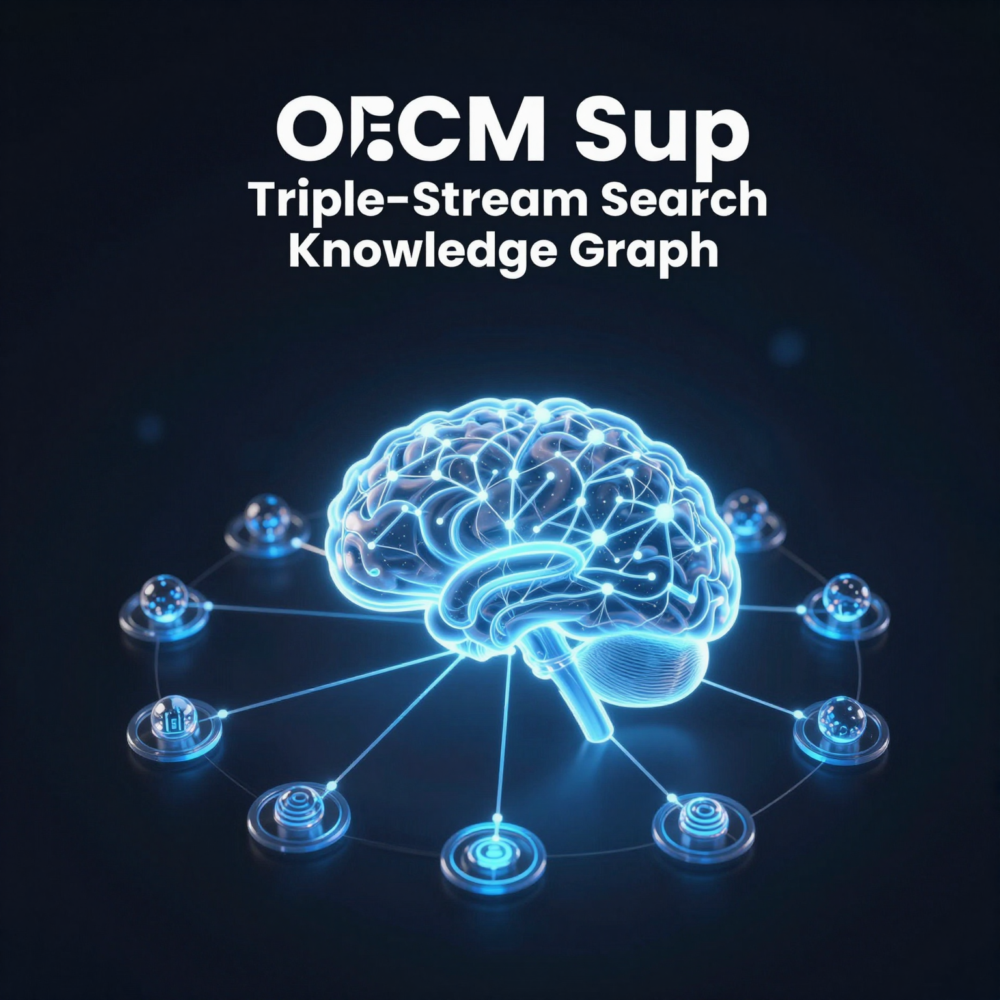

# OCM Sup — OpenClaw Memory System

> 🧠 Jacky's Intelligent Memory System — Triple-Stream Search + Knowledge Graph + Proactive Discovery

[](#)
[](#)
[](https://github.com/st007097-coder/ocm-sup)

## 🔗 Quick Links

| Document | Description | Language |
|----------|-------------|----------|
| [README.md](README.md) | 📖 English version (this page) | English |
| [README_粵語.md](README_粵語.md) | 📖 Cantonese version | 粵語 |
| [README_中文.md](README_中文.md) | 📖 Simplified Chinese (Formal) | 書面語 |
| [TECHNICAL.md](TECHNICAL-en.md) | 🔬 Technical documentation | English |
| [CHANGELOG.md](CHANGELOG-en.md) | 📅 Evolution history | English |
| [TEST-REPORT.md](TEST-REPORT-en.md) | 🧪 Test results | English |
| [cover.webp](cover.webp) | 🖼️ Cover image | |

---

## ⚠️ Important Notice: About This Project

**This is not meant for you to copy.**

Everyone, every Agent, every use case is different. Jacky is a Hong Kong QS (Quantity Surveyor). His system is based on:

- **Work Nature** — Engineering project management, cost estimation
- **Technical Background** — Interested in AI but not an engineer
- **Usage Habits** — Cantonese, Telegram, Obsidian
- **Time Resources** — Spare time, built slowly

**How you should use this project:**

1. **Understand the principles** — Why does OCM Sup need Triple-Stream? Because single search methods are insufficient
2. **Take what you need** — You might only need one or two scripts
3. **Modify for your situation** — Your memory system should serve your needs, not copy all features
4. **Your own ideas are yours** — My evolution direction doesn't mean it's right for you

**You don't need:**
- To completely copy my architecture
- To use all scripts
- To follow my exact timeline

**You need:**
- To understand your actual needs
- To choose the right technical solution for you
- To think and adjust yourself

---

## 🎯 Pain Points & Solutions

> **Every feature exists to solve a real problem.**

---

### 1. Triple-Stream Search

#### 📍 Scenario

Jacky asks: "How's the Kwu Tung Station project progressing?"

#### 😣 Pain Points

| Problem | Description |
|---------|-------------|
| Single search method has poor results | Vector Search only knows "related", doesn't know "Jacky → works_on → Kwu Tung Station" |
| Cross-language results poor | Chinese "古洞站" and English "Kwu Tung Station" don't search to the same result |
| High false positives | Vector search incorrectly returns "Jacky" just because they're often together in training data |

#### ✅ Solution

Triple fusion: `BM25 + Vector + Graph`

```
Query: Kwu Tung Station

BM25: Precise keyword match for "Kwu Tung Station"
Vector: Understand related concepts like "station construction", "MTR project"
Graph: Discover "Jacky → works_on → Kwu Tung Station" relationship

→ Combine results from three channels (RRF Fusion)
```

#### 📝 Example

```
Question: "What has Jacky been working on recently?"

Traditional approach:
Vector Search → Returns a bunch of related but scattered documents

Triple fusion:
1. BM25 finds documents containing "Jacky" and "project"
2. Vector finds semantically related "QS work", "cost estimation"
3. Graph discovers: Jacky → works_on → Kwu Tung Station

→ Returns: Coherent results about Kwu Tung Station project
```

---

### 2. Knowledge Graph

#### 📍 Scenario

Jacky asks: "Does Star know I'm a QS?"

#### 😣 Pain Points

| Problem | Description |
|---------|-------------|
| Information scattered | "Jacky is a QS" fact scattered across documents |
| Relationships unclear | Even if you find Jacky, you don't know his relationship with Kwu Tung Station or OCM Sup |
| Requires manual maintenance | Have to remember which connections go where, easy to miss |

#### ✅ Solution

Build Entity relationship graph:

```
       ┌──────┐
       │ Jacky │ (person)
       └──┬───┘
    works_on│
      ┌─────┴─────┐
      ▼           ▼
┌──────────┐  ┌──────┐
│  Kwu Tung│  │  Star │
│ (project)│  │(system)│
└────┬─────┘  └───┬──┘
     │             │
     │ uses       │ integrates_with
     ▼             ▼
┌─────────────────────┐
│      OCM Sup        │
│      (system)       │
└─────────────────────┘
```

#### 📝 Example

```
Question: "How does Star know about Kwu Tung Station stuff?"

Without Graph:
→ Star says "I searched and found documents about Kwu Tung Station"

With Graph:
→ Star says "Because Jacky works_on Kwu Tung Station, and Star serves Jacky,
   so I remember that Kwu Tung Station is in Jacky's projects"
```

---

### 3. Smart Recall Hook

#### 📍 Scenario

Jacky asks: "What's the latest progress on Kwu Tung Station?"

#### 😣 Pain Points

| Problem | Description |
|---------|-------------|
| Passive waiting | If Jacky doesn't ask, Star doesn't proactively bring it up |
| Requires manual trigger each time | Jacky has to remember to say "search Kwu Tung Station" |
| Unknown trigger timing | Which keywords should trigger search? |

#### ✅ Solution

Automatically identify queries that need triggering:

```python
HIGH_PRIORITY_KEYWORDS = [
    'Jacky', 'Kwu Tung Station', 'Star',  # Core entities
    'project', 'progress', 'update',       # Work-related
    'search', 'find', 'knowledge',        # Action keywords
]

def should_trigger(query):
    # If query contains these words, automatically trigger triple search
```

#### 📝 Example

```
Without Hook:
Jacky: "Kwu Tung Station progress?"
Star: "Oh." (passively waiting for instructions)

With Hook:
Jacky: "Kwu Tung Station progress?"
Star: "Kwu Tung Station is an MTR East Rail Line project, currently in BS (Building Survey) phase..."
    (automatically triggered triple search, provided context)
```

---

### 4. Proactive Discovery

#### 📍 Scenario

Star runs daily but discovers new AI news has no relation to Jacky's work

#### 😣 Pain Points

| Problem | Description |
|---------|-------------|
| Passively waiting for questions | If Jacky doesn't ask, Star doesn't discover new things |
| New and old info not connected | News mentions "ChatGPT" but doesn't know its relation to OCM Sup |
| Requires manual relationship building | Troublesome |

#### ✅ Solution

Automatically infer Entity relationships:

```python
# Rule engine
RELATIONSHIP_RULES = {
    ('person', 'project'): 'works_on',      # Jacky + Kwu Tung Station → works_on
    ('person', 'system'): 'uses',           # Jacky + OCM Sup → uses
    ('project', 'system'): 'uses',         # Kwu Tung Station + OCM Sup → uses
}

# Confidence calculation
confidence = base_confidence + keyword_density + type_compatibility
```

#### 📝 Example

```
Proactive Discovery finds:
- News mentions "Jacky"
- News mentions "Kwu Tung Station"

Automatically infers: Jacky → works_on → Kwu Tung Station

Next time Jacky asks "What have I been doing":
Star: "You've been working on Kwu Tung Station project (BS phase)"
```

---

### 5. HTTP API

#### 📍 Scenario

Other systems want to use OCM Sup's search function but don't know how to call it

#### 😣 Pain Points

| Problem | Description |
|---------|-------------|
| Only usable inside OpenClaw | Other tools (Telegram bot, external scripts) can't use it |
| Not a standard interface | Each script has its own calling method |

#### ✅ Solution

Provide HTTP API:

```bash
# Any tool that can send HTTP requests can use it
curl "http://localhost:5005/search?q=Kwu+Tung+Station&top_k=5"
curl "http://localhost:5005/entities"
curl "http://localhost:5005/health"
```

#### 📝 Example

```bash
# Telegram Bot usage:
Jacky: /search Kwu Tung Station
Bot: → HTTP GET /search?q=Kwu Tung Station
    ← JSON results
Bot: → "Kwu Tung Station is an MTR East Rail Line project..."
```

---

### 6. Graph Visualization

#### 📍 Scenario

Star says: "My Graph has 43 entities, 47 relationships"

#### 😣 Pain Points

| Problem | Description |
|---------|-------------|
| Can't see structure | All text, don't know which is the center |
| Hard to debug | If relationships are wrong, almost impossible to discover |
| Hard to explain | Explaining "what the Graph looks like" to Jacky is troublesome |

#### ✅ Solution

Generate visualization charts:

```bash
# Generate HTML interactive view
python3 graph_visualization.py --format html

# Generate Mermaid diagram
python3 graph_visualization.py --format mermaid
```

#### 📝 Example

```
Graph visualization shows:

        Jacky ──works_on──→ Kwu Tung Station
           │                   │
         uses              uses │
           ▼                   ▼
        Star ←──integrates_with──→ OCM Sup

At a glance:
- Jacky is the center (most connections)
- OCM Sup is another hub
- Kwu Tung Station and Star both connect to Jacky
```

---

### 7. Uncertainty Tracking

#### 📍 Scenario

Jacky asks: "When did you learn about OCM Sup?"

#### 😣 Pain Points

| Problem | Description |
|---------|-------------|
| Answering randomly | Star answers as if remembering, but actually doesn't remember |
| No confidence concept | Doesn't know how much he knows or doesn't know |
| Misleading Jacky | False confidence is worse than not remembering |

#### ✅ Solution

Each claim has metadata:

```python
claim = {
    "content": "Jacky is a QS",
    "confidence": 0.9,           # 90% certain
    "evidence": "Jacky's description",  # Source
    "last_updated": "2026-04-13"  # When updated
}
```

#### 📝 Example

```
Without Uncertainty Tracking:
Jacky: "When did you learn about OCM Sup?"
Star: "I learned about it when it was first built..." (random answer)

With Uncertainty Tracking:
Jacky: "When did you learn about OCM Sup?"
Star: "I don't remember the exact date. Based on my memory,
    it was around April 13-17, 2026. Confidence: 0.6 (unsure)"
```

---

### 8. Confidence-Based Forgetting

#### 📍 Scenario

Jacky asked about a project 6 months ago. The info might be outdated now.

#### 😣 Pain Points

| Problem | Description |
|---------|-------------|
| Stale information persists | Old info stays at full confidence even when outdated |
| No decay mechanism | System treats a 6-month-old fact the same as today's fact |
| Context bloat | Low-value old info consumes context budget |

#### ✅ Solution

Content has half-lives:

```python
HALF_LIVES = {
    'fact': 30,        # Facts decay in 30 days
    'opinion': 7,      # Opinions decay in 7 days
    'news': 3,         # News decays in 3 days
    'project_status': 14,  # Project status decays in 14 days
}

def decay_confidence(claim, days_elapsed):
    decay_factor = 0.5 ** (days_elapsed / half_life)
    return claim.confidence * decay_factor
```

---

### 9. Active Contradiction Detection

#### 📍 Scenario

Jacky previously said "I'm not using EvoMap" but now says "I'm using EvoMap every week"

#### 😣 Pain Points

| Problem | Description |
|---------|-------------|
| Contradictions go undetected | System doesn't notice when new info conflicts with old info |
| No stale marking | Old contradicting info isn't marked as superseded |
| Confusion | Asks about something that was already changed |

#### ✅ Solution

Check for contradictions before writing:

```python
def check_contradiction(new_claim, existing_claims):
    for old_claim in existing_claims:
        if new_claim.same_topic(old_claim):
            if new_claim.conflicts_with(old_claim):
                # Mark old as stale
                old_claim.mark_stale(reason="contradicted by new info")
                return True
    return False
```

---

### 10. Consolidation Loop

#### 📍 Scenario

Daily conversations accumulate. How to distill important stuff to long-term memory?

#### 😣 Pain Points

| Problem | Description |
|---------|-------------|
| Memory bloat | Daily notes accumulate forever, context gets flooded |
| No organization | Everything mixed together, hard to find |
| Manual curation | Have to manually move stuff to wiki |

#### ✅ Solution

Automated distillation:

```
┌───────────────────────────────────────┐
│        Episodic Buffer (Short-term)   │
│  - Daily conversations               │
│  - 7-day retention before distill   │
└─────────────────┬─────────────────────┘
                  │ distill
                  ▼
┌───────────────────────────────────────┐
│        Semantic Wiki (Long-term)     │
│  - Entities + Relationships        │
│  - Refined knowledge                │
└─────────────────┬─────────────────────┘
                  │ distill
                  ▼
┌───────────────────────────────────────┐
│     Procedural Memory (Skills)        │
│  - Skills + Workflows                │
│  - How to do things                  │
└───────────────────────────────────────┘
```

---

## 📋 All 10 Features

| # | Feature | Description | Script |
|---|---------|-------------|--------|
| 1 | Triple-Stream Search | BM25 + Vector + Graph fusion | `triple_stream_search.py` |
| 2 | Knowledge Graph | Entity relationship tracking | `graph_search.py` |
| 3 | Smart Recall Hook | Auto-trigger on keywords | `smart_recall_hook.py` |
| 4 | Proactive Discovery | Auto-find new relationships | `proactive_discovery.py` |
| 5 | HTTP API | Standard search interface | `search_api.py` |
| 6 | Graph Visualization | Visual graph display | `graph_visualization.py` |
| 7 | Uncertainty Tracking | Confidence + decay | `ocm_sup_*.py` |
| 8 | Confidence-Based Forgetting | Content half-lives | `ocm_sup_*.py` |
| 9 | Active Contradiction Detection | Detect conflicts | `ocm_sup_*.py` |
| 10 | Consolidation Loop | Distill episodic → semantic | `ocm_sup_*.py` |

---

## 🚀 Step-by-Step Guide: How to Use

### Prerequisites

```bash
# Install dependencies
pip install rank-bm25 sentence-transformers flask pyyaml numpy

# Ensure Ollama is running (for embeddings)
ollama serve
```

### Step 1: Index Your Wiki

```bash
cd scripts
python3 triple_stream_search.py --index
```

This will:
1. Read all `.md` files from your wiki folder
2. Extract entities and relationships
3. Build BM25 index
4. Generate vector embeddings
5. Build knowledge graph

### Step 2: Search

```bash
# Single query
python3 triple_stream_search.py --query "Kwu Tung Station"

# With top-k results
python3 triple_stream_search.py --query "Jacky" --top_k 5
```

### Step 3: Start HTTP API (Optional)

```bash
python3 search_api.py
# API available at http://localhost:5005
```

### Step 4: Set Up Smart Recall (Optional)

```bash
# Add to your OpenClaw config
# The smart_recall_hook.py will auto-trigger on keywords
```

---

## 🏗️ System Architecture

### Triple-Stream Search Flow

```
┌─────────────────────────────────────────────────────┐
│                    User Query                        │
└─────────────────────┬───────────────────────────────┘
                      │
                      ▼
┌─────────────────────────────────────────────────────┐
│              Smart Recall Hook                       │
│         (should_trigger auto-detection)              │
└─────────────────────┬───────────────────────────────┘
                      │
                      ▼
┌─────────────────────────────────────────────────────┐
│           Triple-Stream Search                       │
│  ┌─────────┐  ┌─────────┐  ┌─────────┐            │
│  │  BM25   │  │ Vector  │  │  Graph  │            │
│  │ Channel │  │ Channel │  │ Channel │            │
│  └────┬────┘  └────┬────┘  └────┬────┘            │
│       └─────────────┼─────────────┘                  │
│                     │                              │
│                     ▼                              │
│              ┌───────────┐                         │
│              │  RRF     │                         │
│              │  Fusion  │                         │
│              └─────┬─────┘                         │
└───────────────────┼─────────────────────────────────┘
                    │
                    ▼
┌─────────────────────────────────────────────────────┐
│                  Results                            │
│         (Ranked, Scored, Annotated)                 │
└─────────────────────────────────────────────────────┘
```

### RRF Fusion Formula

```python
RRF_score(doc) = Σ 1 / (k + rank_channel(doc))
# k = 60 (industry standard)
```

### Knowledge Graph Structure

```yaml
# Entity example
---
title: Jacky
type: entity
entity_type: person
confidence: 0.95
relationships:
  - target: Kwu Tung Station
    type: works_on
    direction: outgoing
---
```

---

## 📁 Project Structure

```
OCM-Sup/
├── README.md           📖 English main page (this file)
├── README_粵語.md      📖 Cantonese version
├── README_中文.md      📖 Simplified Chinese (Formal)
├── TECHNICAL.md        🔬 Technical documentation
├── CHANGELOG.md       📅 Evolution history
├── TEST-REPORT.md     🧪 Test results
├── cover.webp         🖼️ Cover image
└── scripts/
    ├── triple_stream_search.py    Core search engine
    ├── graph_search.py             Knowledge Graph search
    ├── query_expansion.py         Chinese/English query expansion
    ├── graph_visualization.py     Graph visualization
    ├── kg_auto_expander.py        Auto entity expansion
    ├── proactive_discovery.py      Proactive relationship discovery
    ├── smart_recall_hook.py        Smart recall trigger
    ├── smart_recall_cron.py       Cron job for recall pre-warming
    ├── search_api.py               Flask HTTP API
    └── triple_stream_cli.py        CLI interface
```

---

## 🙏 Credits

- **Jacky** — Requirement proposer, tester, direction guide
- **Andrej Karpathy** — Simplicity First principle
- **Aporia Labs** — LLM Wiki v2 architecture reference
- **Anthropic** — OODA Loop / CraniMem inspiration
- **OpenClaw Community** — Framework support

---

_Last updated: 2026-04-18_
_OCM Sup v2.0_
