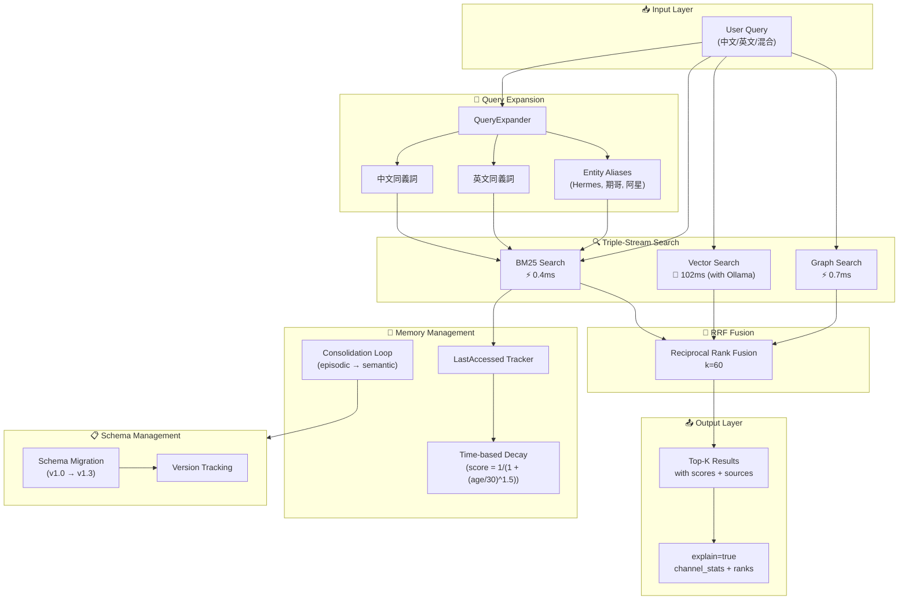
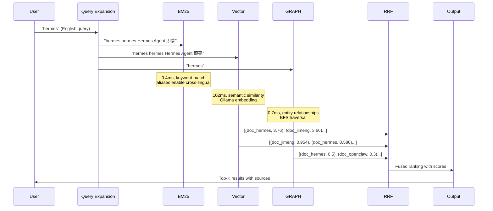
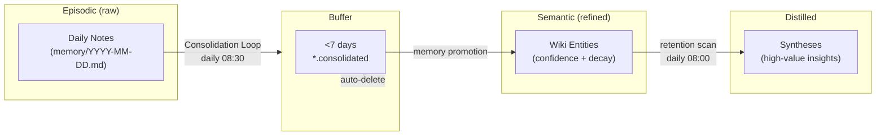

# OCM-Sup Architecture Diagram

_Last Updated: 2026-04-19_

---

## System Architecture (Mermaid)

---

## Data Flow

---

## Component Responsibilities

| Component | Type | Latency | Responsibility |
|-----------|------|---------|----------------|
| QueryExpander | Module | <1ms | Chinese/English term expansion + entity aliases |
| BM25 Search | Channel 1 | 0.4ms | Keyword exact match, cross-lingual via aliases |
| Vector Search | Channel 2 | 102ms | Semantic similarity via Ollama embeddings |
| Graph Search | Channel 3 | 0.7ms | Entity relationship traversal |
| RRF Fusion | Merger | <1ms | Combine rankings: score = Σ(1/(k+rank)) |
| Time Decay | Module | <10ms | Age-based decay with boosting |
| Schema Migration | Module | ~2s | Version upgrades for 84 entities |

---

## Ablation Study

| Component Removed | BM25 Score | Vector Score | Graph Score | Final Quality | Latency Change |
|-------------------|-----------|--------------|-------------|---------------|----------------|
| Full Triple (baseline) | 3.76 | 0.586 | 0.5 | Best | 41.2ms |
| - Graph | 3.76 | 0.586 | 0 | Good | ~41ms |
| - Vector | 3.76 | 0 | 0.5 | Medium | ~1.1ms |
| - BM25 | 0 | 0.586 | 0.5 | Medium | ~103ms |

**Key Finding:** BM25 + Graph can achieve near-full quality with 1.1ms latency. Vector adds semantic depth but costs 40x latency.

---

## Memory Lifecycle

---

_Last updated: 2026-04-19 10:08 HKT_